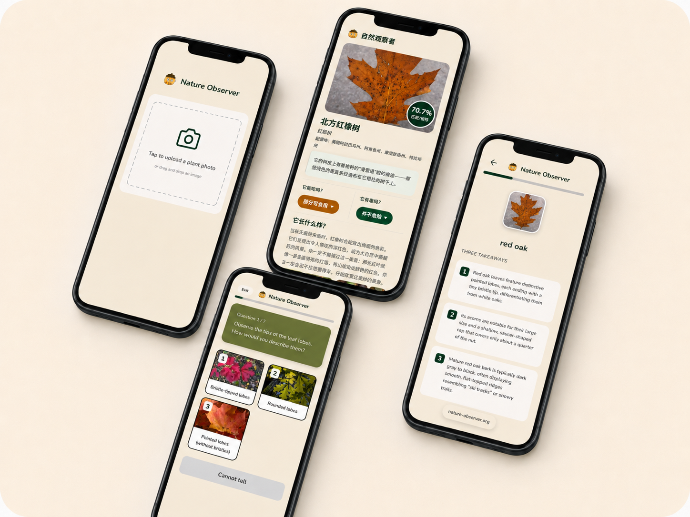

# Nature Observer | 自然观察家

> An AI-powered plant learning application that turns one-off plant identification into active observational learning.
>
> 将一次性的植物识别，转化为主动的观察学习。



## Live Case Study

- [中文站 / Chinese site](https://nature-observer-case-study.yinping884824.chatgpt.site)
- [English site](https://nature-observer-case-study-en.yinping884824.chatgpt.site)

## About the Project

Nature Observer is designed for beginner plant enthusiasts. Most plant-identification tools stop after answering “What is it?” Nature Observer extends that moment into a learning process by helping people observe identifying features, explore selected ecological and cultural stories, test their understanding, and save what they have learned.

This repository contains the source code for the project's product case study website. It documents the product concept, user research, MVP experience, and development journey rather than the production application itself.

## Core Experience

1. Identify a plant from a photo.
2. Follow prompts to observe its defining features.
3. Explore concise ecological and cultural knowledge.
4. Reinforce learning through interactive questions.
5. Save observations for future review.

## User Research

The product direction was informed by four complementary research methods:

- 106 online questionnaire responses
- 24 on-site visitor intercepts
- 15 semi-structured interviews
- Field observation and shadowing at Matthaei Botanical Gardens

These studies helped the team move beyond a name-first identification tool and focus on guided observation, memorable knowledge, and the real learning needs of botanical-garden visitors.

## Current Prototype

The current MVP uses:

- **BioCLIP** for plant identification
- **Gemini** for generating plant knowledge and observation questions
- A guided mobile experience for observation, learning, quizzes, and history

The product is currently at **MVP V2.0** and continues to be developed and tested.

## Website Stack

- Next.js and React
- TypeScript
- Tailwind CSS
- Vinext and Cloudflare Workers-compatible deployment

## Run Locally

Requirements: Node.js `>=22.13.0`

```bash
npm ci
npm run dev
```

Then open the local URL shown in the terminal.

## Repository Structure

- `app/` — case study pages and styles
- `public/assets/` — product, research, and development media
- `worker/` — deployment entry point
- `.openai/hosting.json` — ChatGPT Sites project configuration
